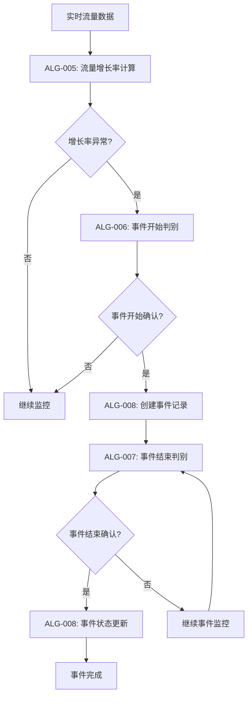

# 交通流量激增事件判别核心算法说明

**文档版本**: v1.0  
**编制时间**: 2024年12月  
**适用场景**: 技术会议、方案汇报、算法评审  

---

## 📋 文档概述

本文档整合了交通流量激增事件判别系统的4个核心算法模块，提供完整的事件检测、判别和管理解决方案。涵盖从流量监控到事件完整生命周期管理的全流程算法设计。

### 🎯 核心算法模块

| 算法编号 | 算法名称 | 主要功能 | 复杂度 |
|---------|----------|----------|--------|
| **ALG-005** | 流量增长率计算算法 | 实时计算流量增长率，检测异常增长 | 4/10 |
| **ALG-006** | 流量激增事件开始判别算法 | 判别激增事件的开始时机 | 6/10 |
| **ALG-007** | 流量激增事件结束判别算法 | 判别激增事件的结束时机 | 5/10 |
| **ALG-008** | 事件持续性管理算法 | 管理事件生命周期和状态转换 | 4/10 |

---

## 🔄 算法协作流程



---

## 🧮 ALG-005: 流量增长率计算算法

### 算法目标
实时计算交通流量的增长率，为事件判别提供核心数据支撑。

### 核心逻辑
```
增长率计算公式:
Growth_Rate = (Current_Flow - Baseline_Flow) / Baseline_Flow × 100%

多时间窗口分析:
- 即时增长率: 5分钟窗口
- 短期增长率: 15分钟窗口  
- 中期增长率: 30分钟窗口
```

### 关键特性
- **多基准对比**: 历史同期、前期平均、动态基准
- **异常增长检测**: 增长率阈值25%，连续监控15分钟
- **数据平滑处理**: 移动平均滤波，减少噪声干扰
- **实时性保障**: 数据处理延迟≤10秒

### 输出结果
```json
{
  "growth_metrics": {
    "instant_growth_rate": 0.28,      // 即时增长率
    "average_growth_rate": 0.32,      // 平均增长率  
    "growth_trend": "increasing",      // 增长趋势
    "anomaly_detected": true           // 异常检测结果
  }
}
```

---

## 🚨 ALG-006: 流量激增事件开始判别算法

### 算法目标
准确判别交通流量激增事件的开始时机，避免误报和漏报。

### 核心逻辑
```
双重验证机制:
1. 服务水平条件: 当前服务水平 ≥ D级 (V/C ≥ 0.8)
2. 增长率条件: 流量增长率 ≥ 25% 且持续 ≥ 15分钟

综合判别:
IF (服务水平 ≥ D级) AND (增长率异常) AND (持续性确认) THEN
    事件开始 = True
    置信度 = 综合评分
```

### 关键特性
- **双重验证**: 服务水平+增长率双重条件确认
- **时间持续性**: 最小持续时间15分钟，避免瞬时波动
- **分级判别**: 不同严重程度的事件采用不同阈值
- **置信度评估**: 输出0-1的判别置信度

### 输出结果
```json
{
  "start_decision": {
    "event_detected": true,            // 事件检测结果
    "confidence": 0.89,               // 判别置信度
    "severity_level": "moderate",      // 严重程度
    "trigger_conditions": [            // 触发条件
      "service_level_D", "growth_rate_high"
    ]
  }
}
```

---

## 🔚 ALG-007: 流量激增事件结束判别算法

### 算法目标
准确判别交通流量激增事件的结束时机，确保事件完整性。

### 核心逻辑
```
流量恢复判别:
1. 恢复率计算: (峰值流量-当前流量)/(峰值流量-基准流量) ≥ 80%
2. 服务水平改善: 当前服务水平 ≤ C级 且持续 ≥ 10分钟
3. 稳定性验证: 变异系数 ≤ 0.15 且趋势斜率 ≤ 2 veh/5min

综合判别:
IF (流量恢复达标) AND (服务水平改善) AND (稳定性确认) THEN
    事件结束 = True
```

### 关键特性
- **基于流量恢复**: 以流量回落到激增前水平为主要依据
- **多维度验证**: 恢复率、服务水平、稳定性三重验证
- **渐进式判别**: 分阶段验证，确保结束判定的可靠性
- **防止误判**: 避免短暂恢复导致的错误结束

### 输出结果
```json
{
  "end_decision": {
    "should_end": true,               // 是否结束事件
    "confidence": 0.85,               // 结束置信度
    "recovery_rate": 0.82,            // 流量恢复率
    "stability_score": 0.91           // 稳定性评分
  }
}
```

---

## 📊 ALG-008: 事件持续性管理算法

### 算法目标
管理事件的完整生命周期，包括状态跟踪、事件合并和持续性验证。

### 核心逻辑
```
事件状态机:
PENDING → STARTING → ONGOING → ENDING → ENDED

状态转换条件:
- PENDING → STARTING: 开始检测置信度 ≥ 0.8
- STARTING → ONGOING: 持续时间 ≥ 15分钟
- ONGOING → ENDING: 结束检测置信度 ≥ 0.7  
- ENDING → ENDED: 结束确认且稳定性验证

事件合并策略:
IF (时间间隔 ≤ 10分钟) AND (空间相邻) AND (特征相似度 ≥ 0.7) THEN
    执行事件合并
```

### 关键特性
- **状态机管理**: 清晰的事件状态定义和转换规则
- **智能合并**: 自动识别和合并相关事件片段
- **持续性验证**: 确保事件的最小持续时间要求
- **并发处理**: 支持多事件并行管理

### 输出结果
```json
{
  "event_management": {
    "current_events": [               // 当前活跃事件
      {
        "event_id": "EVT_20241201_001",
        "status": "ongoing",
        "duration_minutes": 45,
        "severity": "moderate"
      }
    ],
    "state_changes": [...],           // 状态变化记录
    "merge_operations": [...]         // 合并操作记录
  }
}
```

---

## 🎯 算法集成架构

### 数据流设计
```
原始流量数据 
    ↓
ALG-005 (增长率计算)
    ↓
ALG-006 (事件开始判别) ←→ ALG-008 (事件管理)
    ↓                        ↑
ALG-007 (事件结束判别) ←→ ────┘
    ↓
事件结果输出
```

### 性能指标
| 指标类别 | 目标值 | 实际意义 |
|---------|--------|----------|
| **准确性** | ≥90% | 事件检测准确率 |
| **误报率** | ≤5% | 虚假事件比例 |
| **漏报率** | ≤3% | 遗漏事件比例 |
| **实时性** | ≤30秒 | 从数据输入到结果输出 |
| **可用性** | ≥99.5% | 系统正常运行时间 |

---

## 🔧 关键参数配置

### 核心阈值参数
```yaml
# 增长率阈值
growth_rate_threshold: 0.25          # 增长率异常阈值 25%
sustained_duration: 15               # 持续时间要求 15分钟

# 服务水平阈值  
service_level_threshold: "D"         # 事件触发服务水平
recovery_service_level: "C"          # 恢复目标服务水平

# 稳定性参数
recovery_rate_threshold: 0.80        # 流量恢复率阈值 80%
stability_cv_threshold: 0.15         # 变异系数阈值
trend_slope_threshold: 2.0           # 趋势斜率阈值 veh/5min

# 事件管理参数
min_event_duration: 15               # 最小事件持续时间 15分钟
merge_time_threshold: 10             # 事件合并时间阈值 10分钟
```

### 时间窗口配置
```yaml
# 计算窗口
instant_window: 5                    # 即时窗口 5分钟
short_term_window: 15                # 短期窗口 15分钟  
medium_term_window: 30               # 中期窗口 30分钟
baseline_window: 1440                # 基准窗口 24小时

# 验证窗口
stability_check_window: 30           # 稳定性检查窗口 30分钟
service_level_check_window: 15       # 服务水平检查窗口 15分钟
```

---

## 🛡️ 边界条件处理

### 数据异常处理
- **数据缺失**: 线性插值或使用历史平均值
- **异常值**: 3σ原则过滤，IQR方法检测
- **时间戳错误**: 系统时间校正，时序重排

### 系统异常处理
- **算法失效**: 降级到简化判别逻辑
- **资源不足**: 优先处理关键位置和高优先级事件
- **并发冲突**: 事件锁定机制，批量操作优化

### 业务边界处理
- **极端天气**: 调整阈值参数，增加容错范围
- **特殊时段**: 节假日、大型活动期间的参数调优
- **设施故障**: 数据源切换，备用算法启用

---

## 📈 预期效果与收益

### 技术效果
- **检测精度**: 事件检测准确率≥90%，误报率≤5%
- **响应速度**: 事件检测平均延迟≤2分钟
- **系统稳定**: 7×24小时稳定运行，可用性≥99.5%
- **处理能力**: 支持1000+位置并发监控

### 业务价值
- **及时预警**: 提前发现交通异常，缩短应急响应时间
- **精准管控**: 减少误报干扰，提高管理效率
- **数据支撑**: 为交通调度和应急决策提供可靠数据
- **成本节约**: 自动化监控，减少人工巡查成本

### 应用效益
- **高速公路**: 及时发现拥堵事件，优化通行组织
- **收费站**: 预警排队异常，调整开口策略
- **应急管理**: 快速识别异常情况，启动应急预案
- **数据分析**: 积累事件数据，支持长期规划决策

---

## 🚀 实施建议

### 技术架构
- **编程语言**: Python 3.8+ (数据处理优势)
- **数据存储**: PostgreSQL + Redis (关系数据+缓存)
- **消息队列**: RabbitMQ (异步处理)
- **监控系统**: Prometheus + Grafana (性能监控)

### 部署策略
- **微服务架构**: 4个算法模块独立部署
- **容器化**: Docker + Kubernetes 容器编排
- **负载均衡**: 多实例部署，智能负载分配
- **灾备机制**: 主备切换，数据实时备份

### 开发计划
- **Phase 1**: 核心算法开发 (2-3周)
- **Phase 2**: 系统集成联调 (1-2周)  
- **Phase 3**: 测试验证优化 (1周)
- **Phase 4**: 上线运行监控 (持续)

---

## 📞 技术支持

**算法设计团队**: 交通工程算法组  
**技术责任人**: [待填写]  
**联系方式**: [待填写]  
**文档维护**: 随算法版本同步更新  

---

**文档状态**: 设计完成，待开发实施  
**最后更新**: 2024年12月  
**下次评审**: 算法实现完成后 