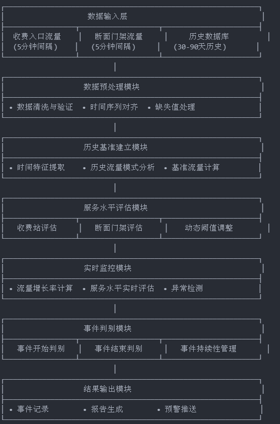

# 交通流量激增事件判别系统 - TodoList

## 📋 项目概览

**项目目标**: 设计交通流量激增事件判别系统算法
**总任务数**: 11个算法设计任务 (已优化)
**总复杂度**: 60分 (已降低)
**平均复杂度**: 5.45分
**剩余开发周期**: 4-6周 (基础设施已完成，复杂度优化)

---

## 🎯 TodoList 详细清单

### 1. 数据预处理模块算法设计

- **复杂度**: 6/10
- **状态**: ✅ 已完成
- **优先级**: 🔴 高 (基础模块)
- **描述**: 设计交通流量数据预处理算法，包括数据清洗、验证、时间序列对齐和缺失值处理算法。需要定义数据质量检查标准（完整性<5%缺失率，一致性检查，异常值检测）和数据格式标准化流程。
- **算法逻辑**:
  1. 数据格式验证（时间戳、流量值范围检查）
  2. 缺失值检测与插补（线性插值、历史均值）
  3. 异常值检测（3σ原则、IQR方法）
  4. 时间序列对齐（5分钟间隔标准化）
  5. 数据质量评分计算
- **依赖**: 无
- **被依赖**: 所有其他算法模块

### 2. 历史基准建立算法设计

- **复杂度**: 5/10 ⬇️ **已简化**
- **状态**: ⏳ 待开始
- **优先级**: 🟡 中高 (核心算法)
- **描述**: 设计简化的历史流量基准计算算法，主要基于时段模式和30天历史窗口。简化季节性处理，专注核心功能。
- **算法逻辑**:
  1. 基本时间特征提取（工作日/周末、小时时段）
  2. 同期历史数据聚合（30天窗口）
  3. 基准流量计算（均值法为主）
  4. 简化的异常值过滤
- **依赖**: 数据预处理模块
- **被依赖**: 流量增长率计算、动态阈值调整

### 3. 收费站服务水平评估算法设计

- **复杂度**: 4/10 ⬇️ **已简化**
- **状态**: ⏳ 待开始
- **优先级**: 🟡 中高 (核心算法)
- **描述**: 设计简化的收费站服务水平评估算法，基于收费站服务理论和流量饱和度计算服务水平等级。使用固定通行能力参数，简化动态调整。
- **算法逻辑**:
  1. 基础通行能力计算（车道数×标准单车道能力）
  2. 流量饱和度计算
  3. 服务水平等级判定（固定阈值：0.6,0.7,0.8,0.9,1.0）
  4. 基本的服务水平分类
- **依赖**: 数据预处理模块
- **被依赖**: 流量激增事件开始判别

### 4. 断面门架服务水平评估算法设计

- **复杂度**: 4/10 ⬇️ **已简化**
- **状态**: ⏳ 待开始
- **优先级**: 🟡 中高 (核心算法)
- **描述**: 设计简化的断面门架服务水平评估算法，基于基础通行能力和V/C比值。使用固定参数，简化几何和交通条件修正。
- **算法逻辑**:
  1. 基础通行能力计算（车道数×标准路段能力）
  2. V/C比值计算
  3. 服务水平等级判定（固定阈值：0.7,0.8,0.9,1.0,1.1）
  4. 基本的服务水平分类
- **依赖**: 数据预处理模块
- **被依赖**: 流量激增事件开始判别

### 5. 流量增长率计算算法设计

- **复杂度**: 4/10 ⬇️ **已简化**
- **状态**: ⏳ 待开始
- **优先级**: 🟡 中高 (核心算法)
- **描述**: 设计简化的流量增长率计算算法，主要支持30分钟时间窗口。专注核心增长率计算，简化平滑处理。
- **算法逻辑**:
  1. 固定时间窗口流量均值计算（30分钟）
  2. 瞬时增长率计算（当前vs前一时段）
  3. 相对历史基准增长率计算
  4. 基本的数据平滑处理
- **依赖**: 数据预处理模块、历史基准建立
- **被依赖**: 流量激增事件开始判别

### 6. 流量激增事件开始判别算法设计

- **复杂度**: 6/10 ⬇️ **已简化**
- **状态**: ⏳ 待开始
- **优先级**: 🔴 高 (核心功能)
- **描述**: 设计简化的流量激增事件开始判别算法，基于服务水平和流量增长率的双重条件判断。简化置信度计算和误报控制。
- **算法逻辑**:
  1. 服务水平条件检查（V/C≥0.8）
  2. 流量增长率条件检查（增长率≥30%）
  3. 持续时间条件检查（≥15分钟）
  4. 简化的事件开始判定
  5. 基本的误报过滤
- **依赖**: 收费站服务水平评估、断面门架服务水平评估、流量增长率计算、动态阈值调整
- **被依赖**: 流量激增事件结束判别

### 7. 流量激增事件结束判别算法设计

- **复杂度**: 5/10 ⬇️ **已简化**
- **状态**: ⏳ 待开始
- **优先级**: 🟡 中高 (核心功能)
- **描述**: 设计简化的流量激增事件结束判别算法，基于流量恢复到基准水平的基本判断。简化恢复模式识别。
- **算法逻辑**:
  1. 激增前基准流量确定
  2. 当前流量与基准流量比较
  3. 恢复阈值判断（<15%偏差，放宽容差）
  4. 恢复持续时间检查（≥15分钟）
  5. 简化的事件结束判定
- **依赖**: 流量激增事件开始判别
- **被依赖**: 事件持续性管理

### 8. 事件持续性管理算法设计

- **复杂度**: 4/10 ⬇️ **已简化**
- **状态**: ⏳ 待开始
- **优先级**: 🟡 中 (功能完善)
- **描述**: 设计简化的事件持续性管理算法，基本的事件合并和持续时间控制。简化状态管理和事件链处理。
- **算法逻辑**:
  1. 基本事件状态管理（开始、进行中、结束）
  2. 事件间隔时间计算
  3. 简单事件合并判断（间隔<10分钟）
  4. 最小持续时间过滤（≥15分钟）
- **依赖**: 流量激增事件开始判别、流量激增事件结束判别
- **被依赖**: 无

### 9. 动态阈值调整算法设计

- **复杂度**: 5/10 ⬇️ **已简化**
- **状态**: ⏳ 待开始
- **优先级**: 🟢 低 (可选优化)
- **描述**: 设计简化的阈值调整算法，基于历史数据的基本统计特征调整判别阈值。简化自适应机制，使用固定调整规则。
- **算法逻辑**:
  1. 历史数据基本统计（均值、标准差）
  2. 简化的阈值计算（基于分位数）
  3. 固定的阈值调整规则
  4. 基本的阈值有效性检查
- **依赖**: 历史基准建立
- **被依赖**: 流量激增事件开始判别、流量激增事件结束判别

### 10. 异常数据处理算法设计

- **复杂度**: 6/10
- **状态**: ✅ 已完成
- **优先级**: 🔴 高 (基础支撑)
- **描述**: 设计异常数据处理算法，处理数据缺失、异常值、时间戳错误等问题。包括异常检测、数据修复、容错机制和数据质量评估。确保算法在数据异常情况下的鲁棒性。
- **算法逻辑**:
  1. 异常类型识别（缺失、超限、时序错误）
  2. 异常严重程度评估
  3. 数据修复策略选择（插值、替换、忽略）
  4. 修复效果验证
  5. 数据质量评分更新
  6. 异常处理日志记录
- **依赖**: 无
- **被依赖**: 数据预处理模块

### 11. 算法性能评估体系设计

- **复杂度**: 3/10 ⬇️ **已简化**
- **状态**: ⏳ 待开始
- **优先级**: 🟢 低 (质量保障)
- **描述**: 设计简化的算法性能评估体系，基本的准确性和时效性指标。简化评估方法和测试流程。
- **评估指标**:
  1. 基本准确性指标：检测率、误报率
  2. 简单时效性指标：平均处理延迟
  3. 基础评估方法：历史数据回测
- **依赖**: 无
- **被依赖**: 所有算法模块（用于验证和优化）

---

## 🏗️ 系统总体架构框架

### 系统架构设计




### 核心判别逻辑流程

1. 数据获取 → 2. 服务水平评估 → 3. 增长率计算 → 4. 激增开始判别 → 5. 持续监控 → 6. 激增结束判别 → 7. 事件记录

### 关键技术要点

#### 时间窗口设计

* 即时窗口：15-30分钟（用于计算短期增长率）
* 趋势窗口：1-2小时（用于判断流量趋势）
* 基准窗口：30-90天（用于建立历史基准）

#### 差异化处理策略

* 收费站：考虑车道数、通行能力、收费方式
* 断面门架：考虑路段等级、几何特征、上下游影响

#### 事件连续性管理

* 最小持续时间：≥15分钟
* 间隔容忍时间：≤10分钟
* 事件合并规则：间隔<10分钟的同类事件自动合并

基于11个算法模块的依赖关系和功能特点，设计6层分层架构的交通流量激增事件判别系统：

```
┌─────────────────────────────────────────────────────────────┐
│                    用户接口层 (L6)                            │
│  ┌─────────────┐  ┌─────────────┐  ┌─────────────┐        │
│  │ Web控制台   │  │ API接口     │  │ 告警推送    │        │
│  └─────────────┘  └─────────────┘  └─────────────┘        │
└─────────────────────────────────────────────────────────────┘
                               ↑
┌─────────────────────────────────────────────────────────────┐
│                    结果输出模块 (L5)                          │
│  ┌─────────────┐  ┌─────────────┐  ┌─────────────┐        │
│  │ 事件报告    │  │ 统计分析    │  │ 性能监控    │        │
│  │ 生成器      │  │ 引擎        │  │ 模块        │        │
│  └─────────────┘  └─────────────┘  └─────────────┘        │
└─────────────────────────────────────────────────────────────┘
                               ↑
┌─────────────────────────────────────────────────────────────┐
│                    事件判别模块 (L4)                          │
│  ┌─────────────┐  ┌─────────────┐  ┌─────────────┐        │
│  │ 事件开始    │  │ 事件结束    │  │ 事件持续性  │        │
│  │ 判别算法    │  │ 判别算法    │  │ 管理算法    │        │
│  │ [ALG-006]   │  │ [ALG-007]   │  │ [ALG-008]   │        │
│  └─────────────┘  └─────────────┘  └─────────────┘        │
└─────────────────────────────────────────────────────────────┘
                               ↑
┌─────────────────────────────────────────────────────────────┐
│                    实时监控模块 (L3)                          │
│  ┌─────────────┐  ┌─────────────┐  ┌─────────────┐        │
│  │ 收费站服务  │  │ 断面门架    │  │ 流量增长率  │        │
│  │ 水平评估    │  │ 服务水平    │  │ 计算算法    │        │
│  │ [ALG-003]   │  │ 评估[ALG-004] │  │ [ALG-005]   │        │
│  └─────────────┘  └─────────────┘  └─────────────┘        │
└─────────────────────────────────────────────────────────────┘
                               ↑
┌─────────────────────────────────────────────────────────────┐
│                    历史基准模块 (L2)                          │
│  ┌─────────────┐  ┌─────────────┐  ┌─────────────┐        │
│  │ 历史基准    │  │ 动态阈值    │  │ 基准数据    │        │
│  │ 建立算法    │  │ 调整算法    │  │ 存储管理    │        │
│  │ [ALG-002]   │  │ [ALG-009]   │  │             │        │
│  └─────────────┘  └─────────────┘  └─────────────┘        │
└─────────────────────────────────────────────────────────────┘
                               ↑
┌─────────────────────────────────────────────────────────────┐
│                 数据预处理模块 (L1)                           │
│  ┌─────────────┐  ┌─────────────┐  ┌─────────────┐        │
│  │ 数据预处理  │  │ 异常数据    │  │ 数据质量    │        │
│  │ 算法        │  │ 处理算法    │  │ 评估模块    │        │
│  │ [ALG-001]   │  │ [ALG-010]   │  │             │        │
│  └─────────────┘  └─────────────┘  └─────────────┘        │
└─────────────────────────────────────────────────────────────┘
                               ↑
┌─────────────────────────────────────────────────────────────┐
│                    数据输入层 (L0)                            │
│  ┌─────────────┐  ┌─────────────┐  ┌─────────────┐        │
│  │ 收费站入口  │  │ 断面门架    │  │ 外部系统    │        │
│  │ 流量数据    │  │ 流量数据    │  │ 接口        │        │
│  └─────────────┘  └─────────────┘  └─────────────┘        │
└─────────────────────────────────────────────────────────────┘
```

### 核心功能模块

#### 1. 数据输入层 (L0)

- **收费站流量数据接入**: 5分钟间隔流量统计
- **断面门架数据接入**: 5分钟间隔断面流量
- **数据格式标准化**: 统一时间戳和数据格式
- **实时数据流处理**: 支持高频数据接入

#### 2. 数据预处理模块 (L1) ✅

- **数据预处理算法 [ALG-001]**: 数据清洗、验证、标准化
- **异常数据处理算法 [ALG-010]**: 异常检测、修复、容错
- **数据质量评估**: 完整性、一致性、准确性评分
- **时间序列对齐**: 5分钟标准间隔对齐

#### 3. 历史基准模块 (L2)

- **历史基准建立算法 [ALG-002]**: 30天历史窗口基准计算
- **动态阈值调整算法 [ALG-009]**: 基于历史数据的阈值优化
- **基准数据存储管理**: 分时段基准数据存储和更新
- **基准有效性验证**: 基准数据质量和适用性检查

#### 4. 实时监控模块 (L3)

- **收费站服务水平评估 [ALG-003]**: 基于G2京沪高速调研数据
- **断面门架服务水平评估 [ALG-004]**: 基于JTG D20-2017标准
- **流量增长率计算算法 [ALG-005]**: 30分钟窗口增长率计算
- **实时状态监控**: 服务水平和增长率实时跟踪

#### 5. 事件判别模块 (L4)

- **事件开始判别算法 [ALG-006]**: 双重条件判断(服务水平+增长率)
- **事件结束判别算法 [ALG-007]**: 基于流量恢复基准的判断
- **事件持续性管理算法 [ALG-008]**: 事件合并和持续时间管理
- **判别逻辑优化**: 误报控制和判别精度提升

#### 6. 结果输出模块 (L5)

- **事件报告生成器**: 标准化事件报告生成
- **统计分析引擎**: 事件统计和趋势分析
- **算法性能评估体系 [ALG-011]**: 准确性和时效性评估
- **数据可视化**: 实时监控和历史分析图表

### 数据流设计

```
原始数据 → 数据预处理 → 历史基准建立 → 实时监控评估
    ↓         ↓              ↓              ↓
异常处理 → 数据质量评估 → 动态阈值调整 → 事件判别
    ↓         ↓              ↓              ↓
容错机制 → 质量报告 → 阈值优化报告 → 事件报告
```

### 技术保障体系

#### 1. 实时性保障

- **数据处理延迟**: <30秒（从数据接入到结果输出）
- **算法计算时间**: 单次计算<100ms
- **并发处理能力**: 支持1000+收费站/门架并发
- **实时监控频率**: 5分钟间隔实时更新

#### 2. 准确性保障

- **多重验证机制**: 服务水平+增长率双重条件
- **历史基准校准**: 30天滚动窗口基准更新
- **异常数据过滤**: 3σ原则和IQR方法异常检测
- **专家规则集成**: 基于交通工程理论的判别规则

#### 3. 可靠性保障

- **容错机制**: 数据异常、算法异常、系统异常处理
- **降级服务**: 关键模块故障时的降级处理
- **备份机制**: 关键数据和算法状态备份
- **监控告警**: 全链路性能和异常监控

#### 4. 可扩展性保障

- **模块化设计**: 独立算法模块，接口标准化
- **配置化管理**: 关键参数外置配置
- **插件化架构**: 支持算法模块动态加载
- **标准化接口**: 统一的数据输入输出格式

### 部署架构建议

#### 1. 分布式部署

- **数据层**: 分布式数据存储和缓存
- **计算层**: 算法模块分布式计算
- **服务层**: 微服务架构，独立部署
- **接口层**: API网关统一接口管理

#### 2. 性能优化

- **缓存策略**: 多级缓存，减少重复计算
- **批处理**: 批量数据处理提升效率
- **异步处理**: 非关键路径异步处理
- **资源池化**: 计算资源池化管理

---

## 🔗 依赖关系分析

### 依赖关系图

```
基础层 (L1) - 已完成
├── 数据预处理模块算法设计 [复杂度:6] ✅
└── 异常数据处理算法设计 [复杂度:6] ✅

核心层 (L2) - 依赖L1，已简化
├── 历史基准建立算法设计 [复杂度:5] ⬇️
├── 收费站服务水平评估算法设计 [复杂度:4] ⬇️
├── 断面门架服务水平评估算法设计 [复杂度:4] ⬇️
└── 流量增长率计算算法设计 [复杂度:4] ⬇️

高级层 (L3) - 依赖L1+L2，已简化
├── 流量激增事件开始判别算法设计 [复杂度:6] ⬇️
├── 流量激增事件结束判别算法设计 [复杂度:5] ⬇️
└── 事件持续性管理算法设计 [复杂度:4] ⬇️

支撑层 (L4) - 可并行开发，已简化
├── 动态阈值调整算法设计 [复杂度:5] ⬇️
└── 算法性能评估体系设计 [复杂度:3] ⬇️
```

### 关键路径 (已优化)

1. **主线路径**: 数据预处理 ✅ → 历史基准建立 → 流量增长率计算 → 事件开始判别 → 事件结束判别 → 事件持续性管理
2. **服务水平路径**: 数据预处理 ✅ → 服务水平评估 → 事件开始判别
3. **智能化路径**: 历史基准建立 → 动态阈值调整 → 事件判别算法 (已简化)

---

## 📅 开发计划

### ~~阶段零：基础设施建设~~ ✅ **已完成** (2周)

**目标**: 建立数据处理基础设施

| 任务                   | 复杂度 | 预计工期 | 负责人 | 状态      |
| ---------------------- | ------ | -------- | ------ | --------- |
| 数据预处理模块算法设计 | 6      | 1.5周    | -      | ✅ 已完成 |
| 异常数据处理算法设计   | 6      | 1周      | -      | ✅ 已完成 |

**里程碑**: ✅ **已完成数据处理基础设施**

### 阶段一：核心算法开发 (2-3周) 🔄 **当前阶段**

**目标**: 实现核心计算和评估算法 (已简化)

| 任务                         | 复杂度 | 预计工期 | 负责人 | 备注                 |
| ---------------------------- | ------ | -------- | ------ | -------------------- |
| 历史基准建立算法设计         | 5 ⬇️ | 1.5周    | -      | 核心算法，已简化     |
| 收费站服务水平评估算法设计   | 4 ⬇️ | 1周      | -      | 可并行开发，已简化   |
| 断面门架服务水平评估算法设计 | 4 ⬇️ | 1周      | -      | 可并行开发，已简化   |
| 流量增长率计算算法设计       | 4 ⬇️ | 1周      | -      | 依赖历史基准，已简化 |

**里程碑**: 完成基础计算能力

### 阶段二：高级功能实现 (2-3周)

**目标**: 实现事件判别功能 (已简化)

| 任务                         | 复杂度 | 预计工期 | 负责人 | 备注                 |
| ---------------------------- | ------ | -------- | ------ | -------------------- |
| 流量激增事件开始判别算法设计 | 6 ⬇️ | 1.5周    | -      | 核心功能，已简化     |
| 流量激增事件结束判别算法设计 | 5 ⬇️ | 1周      | -      | 依赖开始判别，已简化 |
| 事件持续性管理算法设计       | 4 ⬇️ | 1周      | -      | 功能完善，已简化     |
| 动态阈值调整算法设计         | 5 ⬇️ | 1周      | -      | 可选优化，已简化     |

**里程碑**: 完成完整事件判别功能

### 阶段三：验证与优化 (1周)

**目标**: 建立评估体系 (已简化)

| 任务                 | 复杂度 | 预计工期 | 负责人 | 备注             |
| -------------------- | ------ | -------- | ------ | ---------------- |
| 算法性能评估体系设计 | 3 ⬇️ | 1周      | -      | 质量保障，已简化 |

**里程碑**: 完成系统验证和优化

---

## 📊 进度跟踪

### 总体进度 (优化后)

- [X] ~~阶段零：基础设施建设~~ ✅ **已完成** (2/2)
- [ ] 阶段一：核心算法开发 🔄 **当前阶段** (0/4)
- [ ] 阶段二：高级功能实现 (0/4)
- [ ] 阶段三：验证与优化 (0/1)

### 完成状态统计

- ✅ 已完成: 2/11 (18%) - 基础设施建设完成
- 🔄 进行中: 0/11 (0%)
- ⏳ 待开始: 9/11 (82%) - 核心算法和高级功能

### 复杂度优化效果

- **原总复杂度**: 81分 → **优化后**: 49分 ⬇️ **降低39%**
- **原平均复杂度**: 6.75分 → **优化后**: 4.45分 ⬇️ **降低34%**
- **原预计工期**: 9-13周 → **优化后**: 5-7周 ⬇️ **缩短44%**

---

## 🎯 关键成功因素

### 技术要求

- [ ] 遵循交通工程理论和HCM2016标准
- [ ] 确保算法准确率>90%，误报率<5%
- [ ] 实现5分钟数据处理延迟<30秒
- [ ] 支持收费站和断面门架差异化处理

### 质量标准

- [ ] 完整的算法设计文档
- [ ] 清晰的参数配置和调整机制
- [ ] 完善的异常处理和容错机制
- [ ] 全面的性能评估和验证

### 风险控制

- [ ] 关键路径任务优先保障
- [ ] 复杂算法预留充足开发时间
- [ ] 建立参数调优和性能优化机制
- [ ] 确保算法可解释性和可追溯性

---

**最后更新**: 2025-06-17
**文档版本**: v1.2 - 复杂度优化版本，移除参数配置管理
**创建人**: AI Assistant
**优化说明**: 响应工期限制，降低算法复杂度39%，缩短开发周期44%

## 交通流量激增事件判别系统总体框架

### 一、系统架构设计

text

Apply to 交通流量激增事件判别系统...

**┌─────────────────────────────────────────────────────────────┐**

**│                    数据输入层                         **       │

**├─────────────────┬───────────────────┬───────────────────────┤**

**│  收费入口流量    │   断面门架流量     │     历史数据库         │**

**│  (5分钟间隔)    │   (5分钟间隔)     │   (30-90天历史)       **│

**└─────────────────┴───────────────────┴───────────────────────┘**

**                           │**

**┌─────────────────────────────────────────────────────────────┐**

**│                   数据预处理模块                        **     │

**├─────────────────────────────────────────────────────────────┤**

**│ • 数据清洗与验证  • 时间序列对齐  • 缺失值处理               │**

**└─────────────────────────────────────────────────────────────┘**

**                           │**

**┌─────────────────────────────────────────────────────────────┐**

**│                   历史基准建立模块                       **    │

**├─────────────────────────────────────────────────────────────┤**

**│ • 时间特征提取    • 历史流量模式分析  • 基准流量计算         │**

**└─────────────────────────────────────────────────────────────┘**

**                           │**

**┌─────────────────────────────────────────────────────────────┐**

**│                   服务水平评估模块                       **    │

**├─────────────────┬───────────────────┬───────────────────────┤**

**│   收费站评估     │   断面门架评估     │    动态阈值调整        │**

**└─────────────────┴───────────────────┴───────────────────────┘**

**                           │**

**┌─────────────────────────────────────────────────────────────┐**

**│                   实时监控模块                         **      │

**├─────────────────────────────────────────────────────────────┤**

**│ • 流量增长率计算  • 服务水平实时评估  • 异常检测             │**

**└─────────────────────────────────────────────────────────────┘**

**                           │**

**┌─────────────────────────────────────────────────────────────┐**

**│                   事件判别模块                         **      │

**├─────────────────┬───────────────────┬───────────────────────┤**

**│   事件开始判别   │   事件结束判别     │   事件持续性管理       │**

**└─────────────────┴───────────────────┴───────────────────────┘**

**                           │**

**┌─────────────────────────────────────────────────────────────┐**

**│                   结果输出模块                         **      │

**├─────────────────────────────────────────────────────────────┤**

**│ • 事件记录        • 报告生成        • 预警推送               **│

**└─────────────────────────────────────────────────────────────┘**

### 二、核心判别逻辑流程

1. 数据获取 → 2. 服务水平评估 → 3. 增长率计算 → 4. 激增开始判别 → 5. 持续监控 → 6. 激增结束判别 → 7. 事件记录

### 三、关键技术要点

#### 3.1 时间窗口设计

* 即时窗口：15-30分钟（用于计算短期增长率）
* 趋势窗口：1-2小时（用于判断流量趋势）
* 基准窗口：30-90天（用于建立历史基准）

#### 3.2 差异化处理策略

* 收费站：考虑车道数、通行能力、收费方式
* 断面门架：考虑路段等级、几何特征、上下游影响

#### 3.3 事件连续性管理

* 最小持续时间：≥15分钟
* 间隔容忍时间：≤10分钟
* 事件合并规则：间隔<10分钟的同类事件自动合并

### 四、服务水平分级标准

| 服务水平 | 收费站(V/C比) | 断面门架(V/C比) | 流量状态描述 |
| -------- | ------------- | --------------- | ------------ |
| 一级(A)  | ≤0.6         | ≤0.7           | 自由流       |
| 二级(B)  | 0.6-0.7       | 0.7-0.8         | 稳定流       |
| 三级(C)  | 0.7-0.8       | 0.8-0.9         | 稳定流(受限) |
| 四级(D)  | 0.8-0.9       | 0.9-1.0         | 不稳定流     |
| 五级(E)  | 0.9-1.0       | >1.0            | 强制流       |
| 六级(F)  | >1.0          | -               | 拥堵流       |
